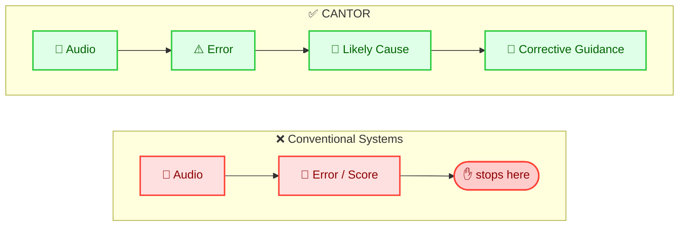
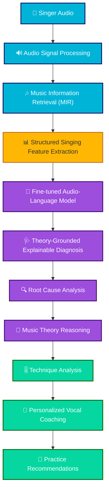
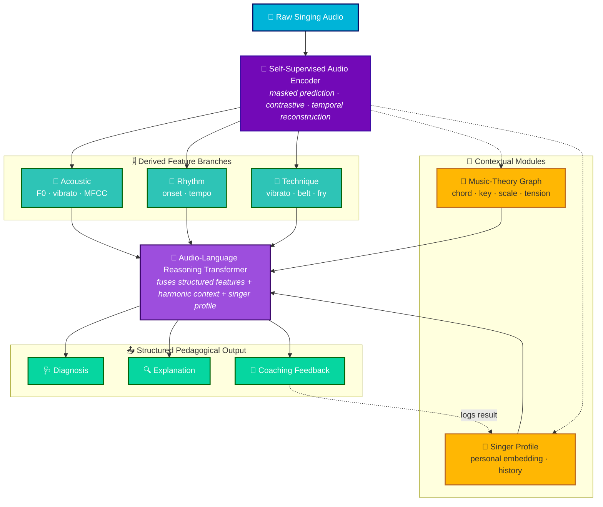
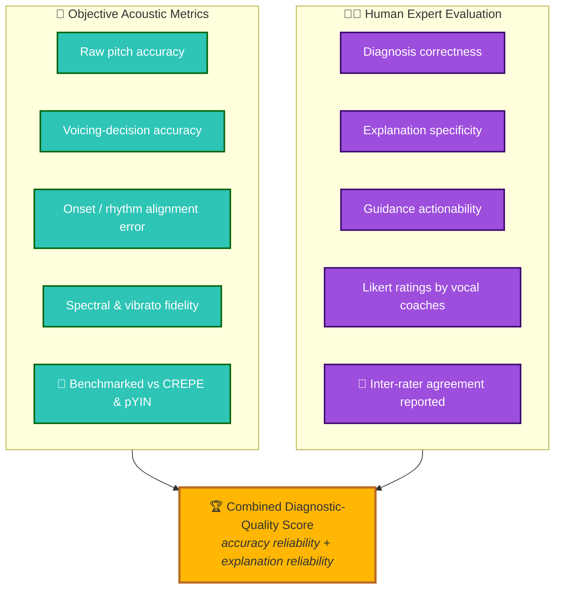

<div align="center">

# 🎼 CANTOR

### *A Causal Audio-Language Framework for Theory-Grounded Explainable Singing Diagnosis*

<br/>


<br/>

> **A machine that hears a flat note can tell you *that* it's flat.**
> **A vocal coach tells you *why* — and what to do about it.**
> **CANTOR is built to answer the second question.**

</div>

---

## ⚡ TL;DR

CANTOR reframes automatic singing assessment from a **scoring problem** into a **reasoning problem**. Instead of mapping audio directly to a score, it models an explicit causal chain —

```
audio  →  error  →  likely cause  →  corrective guidance
```

— by fusing **self-supervised acoustic representations**, **music-theory grounding**, and a **personalized singer profile** into a **fine-tuned audio-language reasoning layer** that produces human-readable, pedagogically actionable diagnoses.

**Design commitment:** the language model **never touches raw audio**. All acoustic understanding happens upstream in dedicated DSP/MIR modules; the LLM reasons over **structured musical features**. Structured representations *are* the interface between hearing and reasoning.

---

## 🎯 The Problem

The last decade of deep learning made singing analysis *precise* — CREPE and pYIN nail sub-semitone pitch, karaoke scorers compare against references, technique classifiers separate vibrato from belt from falsetto. **The numbers improved. The teaching did not.**

Every existing pipeline answers one narrow question:

> *"Is this performance correct, and how close is it to a reference?"*

But singers and educators need a fundamentally different class of answer:

> *"**Why** did this mistake happen, and **how** do I fix it?"*

That gap requires four capabilities that are collectively absent from current systems:

| Capability | Why it matters |
|---|---|
| 🧬 **Causal reasoning** | Attribute an error to a plausible physiological/technical cause, not just flag it |
| 🎵 **Music-theory grounding** | Judge a deviation against *live harmonic function*, not a fixed reference contour |
| 👤 **Personalization** | Condition feedback on a singer's recurring patterns, range, and history |
| 💬 **Interpretability** | Express diagnoses in actionable language, not opaque scalars |

**Research question:** *Can a multimodal, self-supervised audio–language system learn to diagnose, explain, and personally correct singing-performance errors by jointly modeling the acoustic signal, its musical context, and a singer's own history?*

---

## 💡 What Makes CANTOR Different

None of the individual components are novel. **The integration is.** CANTOR's contribution is *methodological, not architectural.*

<div align="center">



</div>

**The four pillars of novelty:**

1. **🧬 Causal error attribution** — a two-stage pipeline (`audio → error → cause`) where the causal stage is *jointly conditioned* on acoustic evidence, harmonic context, and singer history before being verbalized.
2. **🎵 Music-theory-aware evaluation** — pitch is interpreted relative to the *active chord, scale, and harmonic function*, so not all deviations are treated equally.
3. **👤 Personalized singer modeling** — compact embeddings capture recurring tendencies, range, and technique, enabling *longitudinal* feedback instead of one-off scoring.
4. **💬 Audio-language reasoning layer** — the principal NLP contribution: fuses structured signals into *structured causal diagnoses* (e.g., *"instability during the ascending phrase → weak breath support during a chest-to-mixed transition"*).

---

## 🧠 Design Philosophy — *The LLM Reasons, It Does Not Hear*

CANTOR is deliberately **staged**. This is not a monolithic audio-LLM; it is a pipeline where **structured feature representations are the primary interface** between audio processing and language reasoning.

<div align="center">



</div>

**Why this matters (and why it's a contribution, not a limitation):** decoupling perception from reasoning means (i) each stage is independently auditable — a reviewer can inspect the structured features that *caused* a diagnosis; (ii) the reasoning layer inherits the maturity of established MIR tooling instead of relearning pitch tracking from scratch; and (iii) explanations are traceable to concrete acoustic evidence rather than emerging from an opaque end-to-end blob.

---

## 🏗️ System Architecture

<div align="center">



</div>

The dashed loop from **Coaching → Singer Profile** is what makes feedback *longitudinal*: every session updates the singer embedding, so future diagnoses are calibrated to the individual's developmental trajectory.

---

## 🧩 Core Modules

<table>
<tr>
<td width="50%" valign="top">

### 🧬 Self-Supervised Audio Encoder
A transformer pre-trained on **unlabeled singing** via masked prediction (HuBERT-style), contrastive learning (wav2vec 2.0-style), and a **temporal reconstruction** term tailored to *sustained pitch* and *vibrato dynamics* — behaviors that speech-trained encoders systematically under-represent. Produces the shared vocal embedding consumed downstream.

</td>
<td width="50%" valign="top">

### 🎼 Music-Theory Extraction
Builds a **music-theoretic context graph** — pitch contour, chord progression, key, scale membership, harmonic tension — using `music21`, `Essentia`, and `librosa`. Supplies the harmonic reference frame so a deviation is judged against *live function*, not a fixed contour.

</td>
</tr>
<tr>
<td width="50%" valign="top">

### 👤 Singer Intelligence
A singer-embedding network learns a compact profile of technique, range, consistency, and recurring errors. **Updated across sessions** → personalized, longitudinal feedback instead of anonymous one-offs.

</td>
<td width="50%" valign="top">

### 💬 Audio-Language Reasoning
A **decoder transformer** fuses structured features + context graph + singer profile into a diagnosis, causal explanation, and corrective guidance. Trained on **instructor-style templates** + expert-annotated calibration examples.

</td>
</tr>
</table>

---

## 🎚️ Structured Feature Schema

The interface between audio and reasoning. Every diagnosis is grounded in this structured representation — nothing is hallucinated from a raw waveform.

| 🎵 Acoustic | 🥁 Rhythmic | 🎼 Harmonic | 👤 Singer-Specific |
|---|---|---|---|
| Pitch Accuracy | Rhythm Accuracy | Key | Vocal Register |
| Average Pitch Error | Tempo Stability | Chord | Voice Range |
| Maximum Pitch Error | Phrase Consistency | Scale Membership | Breath Stability |
| Vibrato Stability | Dynamics Stability | — | Intonation Consistency |
| Expression Score | — | — | Vocal Technique |
| Confidence Score | — | — | — |

---

## 🗣️ Reasoning Output Schema

CANTOR fine-tunes on an **`Instruction → Input → Output`** format. **Input = structured features. Output = expert coaching.** Structured over unstructured, always.

```jsonc
{
  "instruction": "Diagnose this singing performance and provide personalized coaching.",
  "input": {
    "pitch_accuracy": 0.82,
    "avg_pitch_error_cents": 28,
    "max_pitch_error_cents": 71,
    "rhythm_accuracy": 0.91,
    "tempo_stability": 0.88,
    "key": "A minor",
    "chord_at_deviation": "E7",
    "scale_membership": "harmonic minor",
    "vocal_technique": "belt → mixed transition",
    "vocal_register": "chest-to-mixed",
    "breath_stability": 0.61,
    "vibrato_stability": 0.74,
    "phrase_consistency": 0.79,
    "voice_range": "E3–C5",
    "confidence_score": 0.86
  },
  "output": {
    "performance_assessment": "...",
    "detected_issues": ["..."],
    "root_cause_analysis": "...",
    "music_theory_explanation": "...",
    "technique_analysis": "...",
    "personalized_coaching": "...",
    "recommended_exercises": ["..."]
  }
}
```

**Output fields (always structured):** `Performance Assessment` · `Detected Issues` · `Root Cause Analysis` · `Music Theory Explanation` · `Technique Analysis` · `Personalized Coaching` · `Recommended Exercises`

---

## 📦 Datasets

Five complementary corpora — because **no single resource** covers technique supervision, fine-grained pitch ground truth, large-scale acoustic diversity, *and* validated harmonic annotation at once.

| Dataset | 🎯 Primary Contribution | 🧩 Features Derived / Annotated |
|---|---|---|
| **VocalSet** | 17 techniques · 20 pro singers · 10.1 h a cappella | Technique labels · acoustic embeddings |
| **MIR-1K** | 1,000 karaoke clips · separated vocal/accompaniment | Pitch contours · voicing decisions |
| **DAMP** | Tens of thousands of in-the-wild karaoke takes | Singer diversity for SSL pre-training |
| **TONAS** | 72 flamenco a cappella · corrected transcriptions | High-precision pitch/note ground truth |
| **MedleyDB** | Multitrack · annotation-intensive metadata | Harmonic/melodic context · chord & key |

> 🔗 **Role split:** VocalSet + TONAS → technique/pitch supervision · MIR-1K + DAMP → acoustic scale for self-supervision · MedleyDB → externally validated harmonic grounding for the music-theory graph.

---

## 🧪 Evaluation Protocol — *Dual Track*

Because CANTOR emits **both** quantitative predictions **and** natural-language feedback, evaluation runs on two complementary tracks that combine into a single diagnostic-quality score.

<div align="center">



</div>

---

## 🛠️ Tech Stack

<div align="center">

| Layer | Stack |
|---|---|
| **Modeling** |   |
| **Tuning** |  -blueviolet?style=flat-square) -orange?style=flat-square)   |
| **Data** |  |
| **DSP / MIR** |    |

</div>

---

## 🚀 Fine-Tuning Setup

- **Paradigm:** LoRA-based instruction tuning (`Instruction → Input → Output`)
- **Input:** structured vocal-performance features (never raw audio)
- **Output:** structured expert reasoning + coaching
- **Candidate base models:**

| Model | Params | Role |
|---|---|---|
| Qwen 2.5 3B Instruct | 3B | Efficiency baseline |
| Llama 3.2 3B Instruct | 3B | Efficiency baseline |
| Qwen 2.5 7B Instruct | 7B | Quality baseline |
| Llama 3.1 8B Instruct | 8B | Quality baseline |

---

## 📊 Experimental Plan — *Comparative, Not Isolated*

Every candidate model is evaluated across the same axes so results are a **landscape**, not a single number:

`Loss` · `Inference Speed` · `Memory Usage` · `Output Quality` · `Diagnostic Completeness` · `Music-Theory Correctness` · `Coaching Quality` · `Format Compliance`

---

## 🎯 Expected Outcomes & Impact

The primary deliverable is a **working prototype** that turns a singing clip + its musical context into a *structured, causal explanation* rather than a bare score. Where today's systems say *"you sang flat,"* CANTOR is designed to say *"you sang flat due to weak breath support during a rising melodic interval — here's the drill."*

If it holds up under expert scrutiny, CANTOR enables:

- ✅ **Scalable vocal training** without continuous one-on-one supervision
- ✅ **Accessible, structured** music education where instructors are out of reach
- ✅ **Personalized coaching** via longitudinal singer modeling
- ✅ **Objective progress tracking** across sessions

**Honest about limits:** imperfect causal inference, scarce richly-annotated singing-technique data, and the genuine subjectivity of vocal pedagogy (expert coaches can reasonably disagree on cause). These are mitigated through calibrated uncertainty and expert-in-the-loop validation — not hand-waved away.

---

## 🗺️ Roadmap

- [ ] Self-supervised encoder pre-training on combined corpus
- [ ] Music-theory context graph extraction pipeline
- [ ] Singer-embedding module + longitudinal profile store
- [ ] Structured feature-extraction → training-schema converter
- [ ] LoRA instruction tuning across the four base models
- [ ] Dual-track evaluation harness (MIR metrics + expert Likert)
- [ ] Ablations: theory grounding, singer profile, causal stage
- [ ] Prototype demo + write-up

---

## 📚 Selected References

<details>
<summary><b>Click to expand core citations</b></summary>

- **CREPE** — Kim, Salamon, Li & Bello (2018). *A convolutional representation for pitch estimation.* ICASSP.
- **pYIN** — Mauch & Dixon (2014). *A fundamental frequency estimator using probabilistic threshold distributions.* ICASSP.
- **wav2vec 2.0** — Baevski, Zhou, Mohamed & Auli (2020). NeurIPS 33.
- **HuBERT** — Hsu et al. (2021). *IEEE/ACM TASLP* 29.
- **Audio-MAE** — Huang et al. (2022). *Masked autoencoders that listen.* NeurIPS 35.
- **VocalSet** — Wilkins, Seetharaman, Wahl & Pardo (2018). ISMIR.
- **MIR-1K** — Hsu & Jang (2010). *IEEE TASLP* 18(2).
- **TONAS** — Mora et al. (2010); Gómez & Bonada (2013).
- **MedleyDB** — Bittner et al. (2014). ISMIR.
- **music21** — Cuthbert & Ariza (2010). ISMIR.
- **Essentia** — Bogdanov et al. (2013). ISMIR.
- **XAI taxonomy** — Barredo Arrieta et al. (2020). *Information Fusion* 58.

</details>

---

## 👤 Author

**Saif Ahmed** · ID 2231902642 · ECE (CSE), North South University
📧 `saif.ahmed03@northsouth.edu`

**Supervisor:** Dr. Md Adnan Arefeen — Assistant Professor, Dept. of Electrical & Computer Engineering, NSU
*Course: CSE465 — Pattern Recognition and Neural Network*

---

<div align="center">

### 🎼 *From "was this correct?" to "why was it wrong, and what should I do about it?"*

**CANTOR** — where machine listening finally starts to *teach*.

<br/>


</div>
